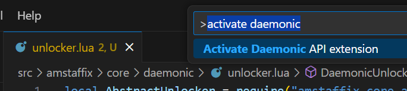

# Daemonic Lua API

A Visual Studio Code extension that provides Lua library definitions for **Daemonic**, enabling IntelliSense, autocompletion, and type checking for Daemonic-specific APIs.

This plugin is community driven, so it would not automatically get updates when Daemonic add new function, please add them by yourself or [create an issue](https://github.com/WoW-U/vscode-daemonic-api/issues/new) and describe what should be added

[Join Discord](https://discord.gg/Gc4GjArZus) to discuss and participate.

## Instruction

- Press `CTRL + SHIFT + P` to open the command palette
- type `Activate Daemonic API Extension` and press enter



## Features

- Added all methods from [official API documentation](https://daemonic.cc/estore/daemonic-api/)

## Example
Here’s an example of how to use Daemonic APIs with autocompletion and type checking:

```lua
---@type Daemonic
local dmc = ...

-- Use Daemonic APIs with IntelliSense support
dmc.ObjectExists("target") -- Autocompletion and type checking will work here
```

## Requirements

- [Lua VSCode extension](https://marketplace.visualstudio.com/items?itemName=sumneko.lua)  must be installed for this extension to work.

## Contributing

Contributions are welcome! If you have any ideas, suggestions, or issues, please open an issue or submit a pull request.

1. Fork the repository.
2. Create a new branch (`git checkout -b feature/YourFeatureName`).
3. Commit your changes (`git commit -m 'Add some feature'`).
4. Push to the branch (`git push origin feature/YourFeatureName`).
5. Open a pull request.

## License

This project is licensed under the MIT License. See the [LICENSE](https://github.com/WoW-U/vscode-daemonic-api/blob/main/LICENSE) file for details.

---

Enjoy using Daemonic Lua API! If you have any questions or feedback, feel free to [open an issue](https://github.com/WoW-U/vscode-daemonic-api/issues).
